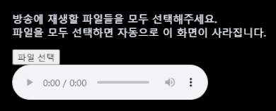

# ChzzkSoundItem
Sound Item for Chzzk

### 이 프로그램은?
- OBS 와 연동하여 특정 상황에서 지정한 이름의 사운드 파일을 재생 시켜주는 프로그램 입니다.
- 매번 OBS 를 새로 켤 때 마다 새로 셋팅을 해 주어야 하는 불편함이 있습니다.
- 이 프로그램은 트위치에서 사용 가능한 사운드 얼럿과 비슷한 환경을 조성 하는데 도움을 드립니다.
- 저작권 있는 음성 사용은 보호받지 못할 수 있으니 본인 음성 등 저작권에 위배되지 않는 mp3 파일을 이용해 주세요.
- 동시에 여러 /재생 명령이 있어도 순차적으로 재생되도록 프로그래밍 되어 있습니다.

### 개발 목적
- 이 프로그램은 치지직 방송 하시는 분들을 위해 공개한 오픈 프로젝트 입니다.

### 라이선스
- 이 프로젝트는 소스를 공개한 오픈 소스 프로젝트(Open Source Project) 입니다.
- 이 프로젝트는 [CC BY-NC 한글](https://creativecommons.org/licenses/by-nc/4.0/deed.ko), [CC BY-NC English](https://creativecommons.org/licenses/by-nc/4.0/) 를 따릅니다. 누구나 무료로 이용할 수 있지만, 상업적으로 사용해선 안됩니다.
- 방송을 하면서 수익활동(후원등)을 하지 말라는 이야기가 아닙니다. 이 프로그램을 판매 하는 행위만 하지 않고 얼마든지 무료로 이용하시면 됩니다.

### 사용 방법 (프로젝트 다운로드 및 필수 선행 작업 -1-)
- 이 프로젝트를 다운로드 받습니다.
- 공개 프로젝트 주소는 https://github.com/minisv/ChzzkSoundItem 입니다.
- 이 주소가 아닌 곳에서 다운로드 받으신다면 악성코드 등을 의심하셔야 합니다.
- 위의 주소에 접속하면 녹색  버튼을 눌러서 Download Zip 을 클릭해주세요.
- 프로젝트를 Zip 파일로 압축하여 받으셨다면 적당한 위치에 압축을 해제해 주세요.
- 편의상 C:\ChzzkSoundItem\ 에 압축을 풀었다고 가정해 보겠습니다.
- 그렇다면 C:\ChzzkSoundItem\ 에 index.html 파일이 있어야 합니다.
- 우선은 chatChannelID 를 알아야 하니 다음 설명을 보시고 chatChannelID 를 복사해주세요.

### chatChannelID 알아오는 방법 (필수 선행 작업 -2-)
- 예를 들어, https://chzzk.naver.com/769788af1e0d5fc7caeeb025504e62d8 채널주소가 이와 같다면? 76으로 시작하는 긴 값이 여러분의 채널 아이디 값이 됩니다.
- https://api.chzzk.naver.com/polling/v2/channels/(여러분의채널아이디값)/live-status 로 접속하면 chatChannelID 뒤의 값이 나옵니다. 여러분의 채널 아이디 값을 대입하여 확인해 주세요.
- 크롬창에서 보실 때의 화면에선 보기 힘들 수 있으니 "pretty print 적용" 을 체크 해 주시면 깔끔하게 보실 수 있어요.
- 위의 값을 대입하면 저의 경우는 "chatChannelId": "N1nO-6" 로 확인이 됩니다.
- 해당 값을 사용 방법에서 안내한 주소 처럼 ?chzzk=chatChannelID 로 셋팅 하면 됩니다.
- 그렇다면 제가 사용해야 하는 주소는 https://minisv.github.io/ChzzkCount/?chzzk=N1nO-6 가 됩니다.
- 방송하시는 분들 마다 채널ID 가 다 다르고, 방송의 채팅에 사용되는 chatChannelId 가 다 다르기 때문에 위의 과정을 꼭 거쳐주셔야 합니다.
- 19금 방송의 경우 chatChannelId 를 알아온다고 해도 네이버에 인증값을 넘기지 않으면 채팅을 가져올 수 없습니다.
- 이 프로그램은 채팅 인증 기능을 지원하지 않습니다. 해당 기능이 필요하신분은 와우봇이나 기타 다른 프로그램을 이용해주세요.

### OBS 연동 방법
- OBS 소스 목록에서 아래 + 버튼을 누르고 "브라우저" 를 눌러서 추가해주세요.
- 적당히 이름을 지어주고, URL 에 위의 사용 방법을 따라 했다면 C:\ChzzkSoundItem\index.html?chzzk= 뒤에 chatChannelID 를 공백없이 붙여넣어주세요.
- 너비 400 높이 160 을 설정해 주시고 잘 나오는지 확인 하시면 됩니다.
-  이렇게 생긴 화면의 파일 선택을 눌러서 방송에 채팅과 연동하여 재생할 파일들을 선택해주세요.
- 여러개의 파일을 선택할 수 있고, 선택을 한다면 자동으로 등록이 된 다음 위의 이미지가 사라지게 됩니다.
- 아쉽지만 특정 위치에 있는 mp3 파일들을 자동으로 등록 시키는 것이 보안상 위배가 되어 막혀 있다고 합니다.

### 재생 할 mp3 파일 관리
- 파일은 프로젝트를 보시면 미리 sound 폴더를 만들어 두었고 그 안에 mp3 파일로 넣어 두시면 됩니다. (mp3 만 지원합니다.)
- 방송 도중에 실시간으로 새로 녹음한 파일을 추가해야 하는 경우에는 OBS 에 연동한 이름을 소스 목록에서 클릭하시면 미리보기 화면 밑 소스 목록 위, 가운데 화면에 새로고침 버튼이 있습니다. 새로고침 버튼을 클릭하면 다시 파일 선택을 할 수 있는 화면으로 바뀌게 됩니다.

### 치지직 닉네임당 /재생 횟수 제한 안내
- 한개의 아이디 (치지직 닉네임) 으로 너무 많은 /재생 을 하여 방송 흐름에 방해가 되는 것을 방지 하기 위하여 제약사항을 만들어 두었습니다.
- js/websocket.js 파일의 44줄의 if (nicknameCommandCounts[nickname][command] < 5) { 부분의 숫자 5 를 바꾸시면 더 많이 재생하거나 더 적게 재생하게 할 수 있습니다.

### 주의 사항
- 19금 방송이 체크된 경우 데이터를 확인 할 수 없습니다.
- 19금 방송의 경우는 채팅에 인증된 아이디로 로그인 해야 하는 방식이므로, 로그인 과정이 생략된 이 방법으로는 데이터를 활용할 수 없습니다.
- 위의 chatChannelID 값은 19금 방송일 때와 19금 방송이 아닐때 각기 다른 채팅 채널값을 얻어오게 됩니다. 이용에 주의해주세요.
- 와우봇 처럼 계정 인증을 통하여 채팅 채널에 로그인 한 것이 아니므로 자동으로 채팅에 남은 시간 알림 등 와우봇 고유기능을 사용할 수 없습니다.
- 더욱 확장된 기능을 사용하고 싶으시다면 계정 인증을 통한 프로그램을 사용해주세요.
- 이 프로그램은 치지직의 사정으로 방송 채팅 채널 연결 방법 변경 등으로 사용이 중지된 경우에는 사용할 수 없습니다.

### 명령어 안내
- 치지직 채팅에서 입력해주세요.
- /재생 파일이름
- 닉네임 기준 5회의 제약사항이 있습니다. (제약사항 조절에 대하여서는 위의 '치지직 닉네임당 /재생 횟수 제한 안내 를 참조해 주세요.)

### 와우봇 소개
- 이 프로젝트는 와우봇 개발중 일부 프로그램을 공개형으로 전환한 것 입니다.
- 와우봇은 방송을 좀 더 재밌고 쉽게 할 수 있도록 도와주는 프로그램 입니다.
- 와우봇에서는 /재생 에 자체 채널 포인트 시스템인 '룬' 을 이용하도록 설계 되어 있습니다. 룬만 있다면 무한대 재생을 할 수 있습니다.
- 와우봇에서는 OBS 에서 파일 선택 등의 과정 없이 이용 가능합니다.
- 와우봇에서는 조금 더 많은 기능들을 만나보실 수 있습니다.

### 궁금한점은?
- 디스코드 minirune 으로 친구요청 하시고 문의 하여 주시기 바랍니다.
- 친구요청 하실때엔 치지직 방송채널 링크도 함께 보내주시면 더 좋겠습니다.

### 마무리 글
- 이 프로그램은 [미니룬](https://chzzk.naver.com/769788af1e0d5fc7caeeb025504e62d8)이 개발하였습니다. 기능 테스트에 필요하니 팔로우 부탁드려요. 고맙습니다.